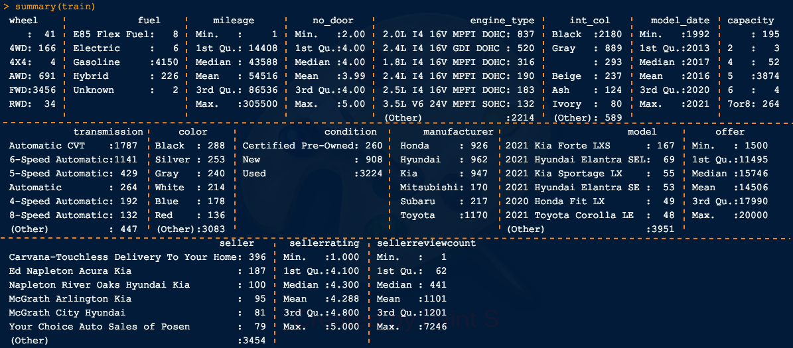
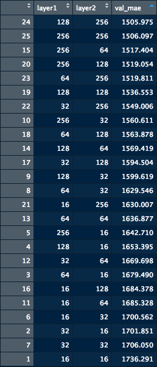

# About this project

The goal of this project was to estimate used car prices.

In this project, I did:
- Web scaping using Python and R
- Built and cleaned up the dataset
- Apply deep learning regression in R for estimation

# Used Car Pricing - Deep Neural Network 

This project focused on used car pricing below $20000 offering. Due to the limitation of dataset building, the brands were limited to Toyota, Honda, Mitsubishi, Hyundai, Kia and Subaru. Although the data used was publicly available, the dataset built in this project was solely for academic and research purposes, it did not, will not and should not be used in any businesses.

# Dataset

The dataset has the following variables:

# Model and results

The price of an used car could be estimated by a deep neural network. The model was a 2-layer densely connected network. The number of nodes in each layer was found by using the tuneGrid below. Noted that the models were sorted by the mean absolute error (mae) of the model on the hold-out validation dataset.

The best performance was from a 2-layer model with 128 nodes on the first hidden layer, and 256 nodes on the second hidden layer. The mae is $1505.98. 

# Conclusion

This range of error, ±$1500, was reasonable because it was quite common that a few thousands dollars discount appeared on some used car if the listing was long enough. From used car dealers' point of view, this mae could provide insight on what is the reasonable price range for a certain car if the car condition is unknown. They could list the car using the ceiling of this price range. From indiviudal sellers' point of view, this price range could provide insight on how much the car dealer is going to list their cars. This insight could be a useful reference to get a good deal.
